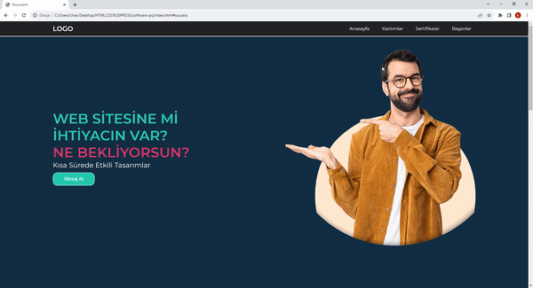

<h1>software-project</h1>

I designed a website for a software company. In the project, I included the programming languages the company uses and the certifications it possesses. I designed the navbar areas to establish direct connections when clicked. I enriched the entire project with icons and visuals.

<h2> Technologies I Use </h2>

I designed my project with HTML5 and CSS3 codes.

<h2>Screenshot</h2>

